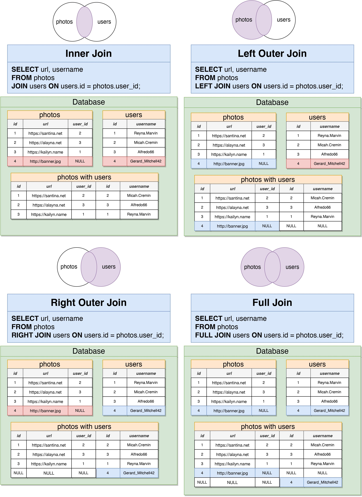
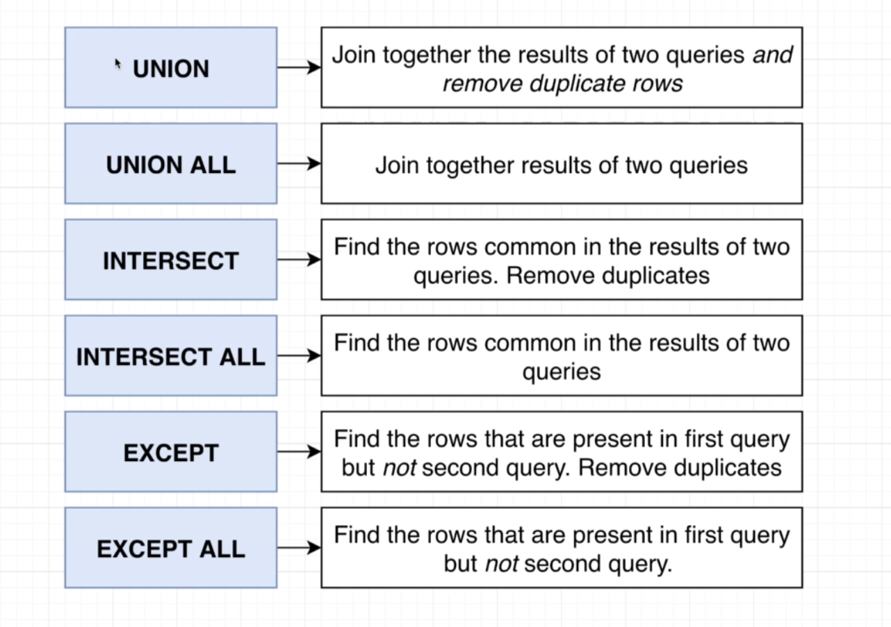
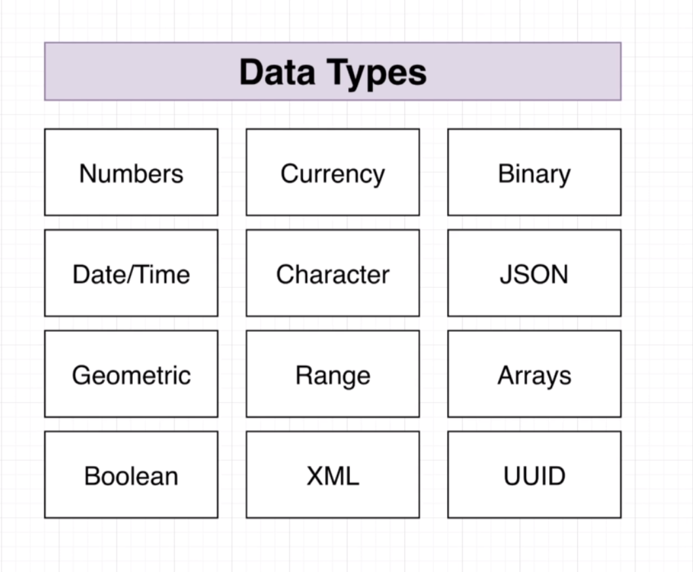
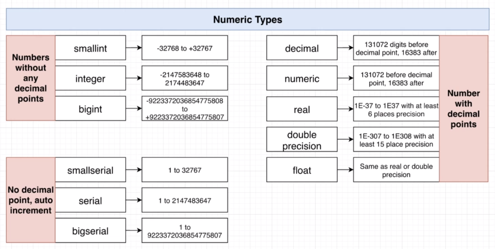
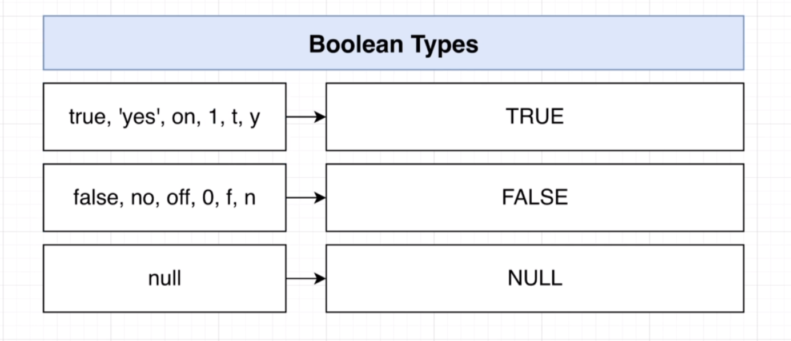
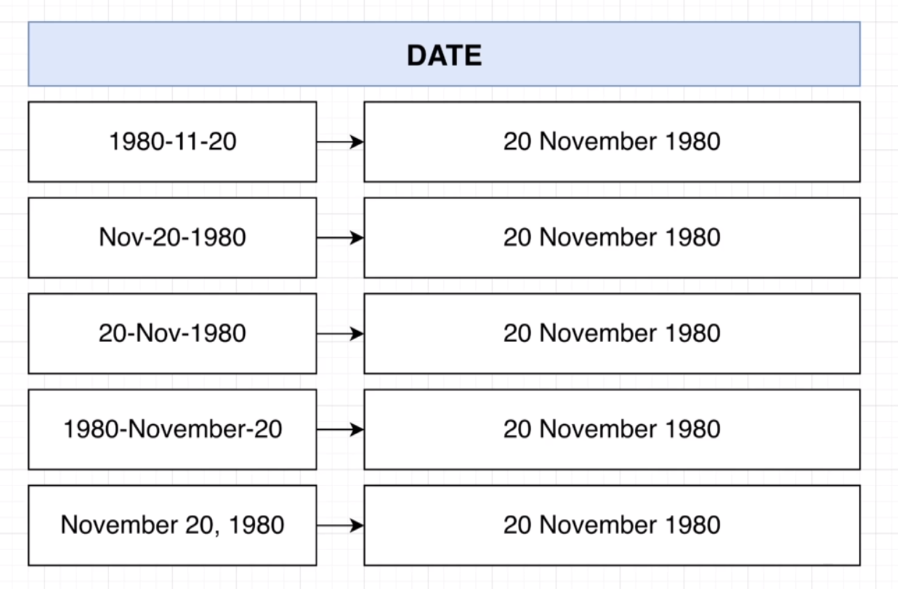

# SQL
sql queries

<h2>Create Table</h2>

```sql
CREATE TABLE cities (
    id SERIAL PRIMARY KEY
    country_id INTEGER REFERENCES country(id),
    name VARCHAR(50),
    population INTEGER,
    aria BIGINT
);
```


<h2>Insert Data</h2>

```sql
INSERT INTO cities(name, country, population, area)
VALUES ('Dehli', 'India', 2546000, 6125),
       ('Shanghai', 'China', 22125000, 4015),
       ('Sao Paulo', 'Brazil', 20935000, 3043);
    
```

<h2>Calculated Column</h2>

```sql
SELECT name, population/area  
AS populationDensity 
FROM cities 
ORDER BY populationDensity DESC;
```

<h2>String Functions </h2>


```sql
SELECT name, 
CONCAT(name, ', ', country) AS location, 
LENGTH( name ) AS name_length,
UPPER(name) AS upper_name 
FROM cities;
```

<h2> Update query </h2>

```sql 
UPDATE cities
SET population = 39505000
WHERE name = 'Tokyo';
```


<h2> Delete query </h2>

```sql
DELETE FROM cities
Where name = 'Tokyo';
```
<h2>SQL information</h2>
<p>
Foreign key constraint checks every foreign key ids existence.
we can set foreign key to null if null: true attribute exist.
</p>

<p>
ON DELETE <br>
RESTRICT ( default ): Throw an error on delete. <br> 
NO ACTION: Throw an error on delete. <br>
CASCADE: Delete related data too!<br>
SET NULL: Set the foreign key to NULL.<br>
SET DEFAULT: Set the foreign key to a provided default value.<br>
</p>
JOINS <br>
<br>
<br>



<br>
<br>
<p>Full join</p>

```sql
SELECT * FROM
users 
FULL JOIN photos
ON users.id = photos.user_id;
```
<p>Left join</p>

```sql
SELECT * FROM
users 
LEFT JOIN photos
On users.id = photos.user_id;
```
<p>Right join</p>

```sql
SELECT * FROM
users 
RIGHT JOIN photos
On users.id = photos.user_id;
```

<p>Inner join</p>

```sql
SELECT * FROM
users 
JOIN photos
ON users.id = photos.user_id;
```


<h2>Some complicated queries</h2>

```sql
SELECT first_name, last_name, paid, users.id 
FROM users 
LEFT JOIN orders 
ON users.id = orders.user_id 
ORDER BY users.id DESC 
OFFSET 10 
LIMIT 10;
```


Union

```sql
(SELECT * FROM products ORDER BY price DESC LIMIT 4) UNION 
(SELECT * FROM products ORDER BY price / weight DESC LIMIT 4);
```

union needs to select the same amount of columns;


Intersect

```sql
(SELECT * FROM products ORDER BY price DESC LIMIT 4) INTERSECT 
(SELECT * FROM products ORDER BY price / weight DESC LIMIT 4);
```


Except 

```sql
(SELECT * FROM products ORDER BY price DESC LIMIT 4) EXCEPT 
(SELECT * FROM products ORDER BY price / weight DESC LIMIT 4);
```

<br>
<br>

<br>
<br>


<h2>
Sub queries
</h2>


```sql
SELECT name , price
FROM products
WHERE price > (
	SELECT MAX(price) 
	FROM products 
	WHERE department = 'Toys');
```

```SQL
SELECT name, price_weight_radio
FROM (
	SELECT name , price / weight AS price_weight_radio
	FROM products)
AS p 
WHERE price_weight_radio > 10
```

from sub query must have an alias.


```sql
SELECT * FROM
   (SELECT max(price) 
    FROM products) 
AS max_price;
```

```sql
SELECT AVG(count)
FROM 
    (SELECT user_id ,COUNT(*)
    FROM orders
    GROUP BY user_id)
AS order_count_per_user;
```

```sql
SELECT id 
FROM orders 
WHERE product_id 
IN (
	SELECT id FROM products WHERE price/weight > 5
);
```

<P>All operator</P>

```sql
SELECT name, department, price 
FROM products WHERE price > ALL
(
	SELECT price 
    FROM products 
    WHERE department = 'Industrial'
);
```

all means that this result is greater than all of the result in sub query. you can do this without all operator like this:

```sql
SELECT name, department, price 
FROM products WHERE price >
(
	SELECT MAX(price) 
    FROM products 
    WHERE department = 'Industrial'
);
```

<P>Some and Any operator</P>

```sql
SELECT name, department, price 
FROM products WHERE price > SOME/ANY
(
	SELECT MAX(price) 
    FROM products 
    WHERE department = 'Industrial'
);
```
This query means that get all of the products that has a price greater than one of the result in sub query.


<h2>Correlated sub query</h2>

```sql
SELECT name, department, price 
FROM products 
AS p1  -- LO0P ONE
WHERE p1.price = (
    SELECT max(price) 
    FROM products 
    AS p2  -- LOOP TWO
    WHERE p2.department = p1.department
);

```
<p>Correlated sub query and equal one with join</p>

```sql
SELECT id, name, (
    SELECT COUNT(*) 
    FROM orders 
    AS o 
    WHERE p.id = o.product_id)
FROM products 
AS p ORDER BY p.id;
``` 
equals to

```sql
SELECT products.id ,COUNT(products.id)
FROM products 
JOIN orders 
ON product_id = products.id 
GROUP BY products.id 
ORDER BY products.id;
```

<h2>Select with out from</h2>

```sql
SELECT 
(
   (SELECT MAX(price) 
    FROM products) / 
   (SELECT MIN(price) 
    FROM products)
) 
AS max_min_radio;
```

<h2>Postgresql functions</h2>

<p>GREATEST</p>


```sql
SELECT name, weight, GREATEST(30 , 2 * weight) 
FROM products;
```
> *LEAST*

```sql
SELECT name, price, LEAST(400 , 0.5* price) 
FROM products;
```
> *CASE*

```sql
SELECT name, price, 
CASE
	WHEN price > 600 THEN 'high'
	WHEN price > 300 THEN 'medium'
	ELSE 'cheap'
END
FROM products;
```

> *COALESCE*

```sql
ALTER TABLE likes
ADD CHECK 
(
    COALESCE((post_id)::BOOLEAN::INTEGER, 0))
    + --COALESCE return the first not null value
    COALESCE((comment_id)::BOOLEAN::INTEGER, 0))
) = 1; -- this check that one of the post_id or comment_id has a valid integer value and both of the cant be null at the same time.
```
# Postgresql data types



<br>
<br>

> Numeric
> 
> 


> Boolean
> 
> 

> Date
> 
> 


## Cast Types


> We could change the result data type by **::** operator 
```sql
SELECT (AVG(count)::FLOAT)
FROM 
    (SELECT user_id ,COUNT(*)
    FROM orders
    GROUP BY user_id)
AS order_count_per_user;

```
# Validation

## Constraint
> add constraint
```sql
ALTER TABLE user
ALTER COLUMN username
SET NOT NULL
```

```sql
ALTER TABLE user
ALTER COLUMN price
SET DEFAULT 999;
```


```sql
ALTER TABLE user
ALTER COLUMN email
SET UNIQUE true;
```
>add multi-column uniqueness

```sql
ALTER TABLE user
ADD UNIQUE (username, email)  --username and email must be unique together
```
> Remove constraint from table

```sql
ALTER TABLE user
DROP CONSTRAINT <name_of_constraint>
```

> Check validation

```sql
CREATE TABLE products
price INTEGER CHECK (price > 0)
```
